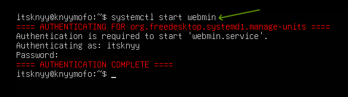
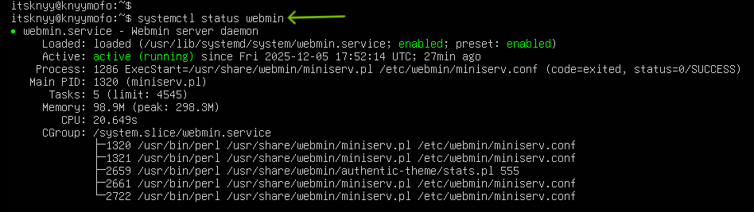
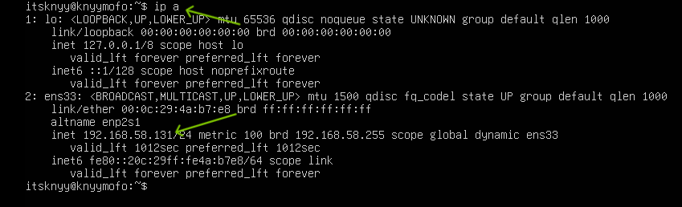
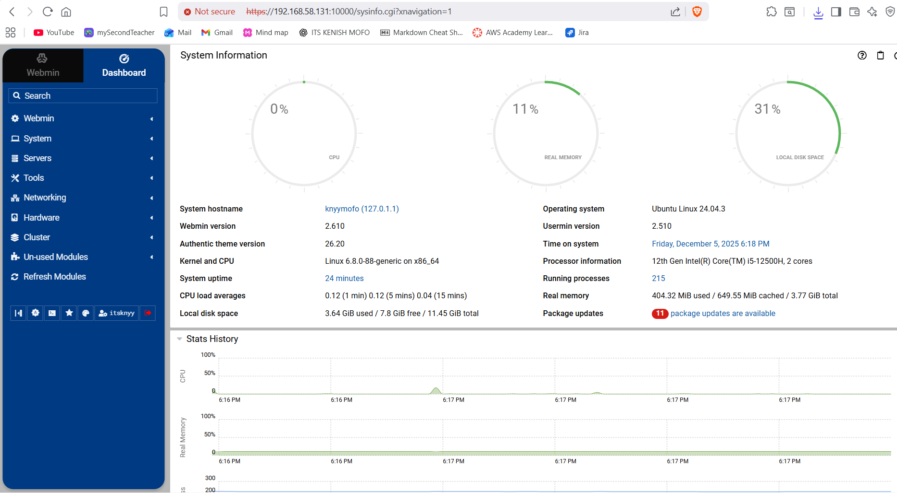

# Task: Run Webmin on a VM with CLI based OS

## 1. Installation

Use the following  commands to download and install Webmin by setting up the repo through the script: 

    curl -o webmin-setup-repo.sh https://raw.githubusercontent.com/webmin/webmin/master/webmin-setup-repo.sh

    sudo sh webmin-setup-repo.sh

## 2. Accessing Webmin from VMware (NAT Mode)

In NAT mode (Network Address Translation) on VMware:

- The **VM** gets a **private IP** (e.g., 192.168.x.x) and can access the internet via the host (Windows), but it is not directly accessible from outside the host.
- The **host (Windows)** and **VM** can communicate with each other because the **VMware NAT router forwards** requests between them.
- Webmin on the Ubuntu VM can be accessed from the **Windows host** using the VM’s private IP (e.g., https://192.168.x.x:10000).
- **Port forwarding** is not needed for local communication within the same network (host and VM). It’s only needed for external access (from outside the local network).

## 3. Starting and Accessing Webmin 

### 3.1. Starting Webmin Service

Use `systemctl start webmin` to start the Webmin service, and authenticate with your password if prompted for root privileges.

### 3.2. Webmin Service Status

Use `systemctl status webmin` to check if the Webmin service is active and running.

### 3.3. Checking IP Address on Ubuntu

Use ip a to find the IP address of Ubuntu VM (e.g., 192.168.58.131) for accessing Webmin.

### 3.4. Accessing Webmin Dashboard

The Webmin Dashboard can be accessed at http://192.168.58.131:10000. Webmin is a web-based interface for system administration that allows users to manage Unix-like systems, services and configurations through a browser.

---