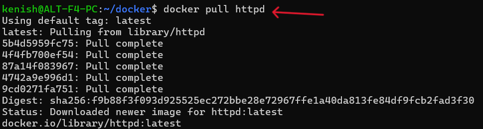
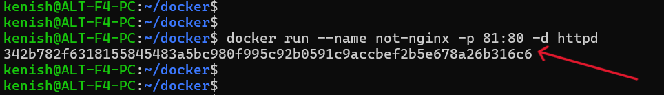
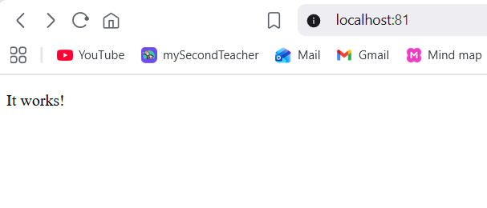
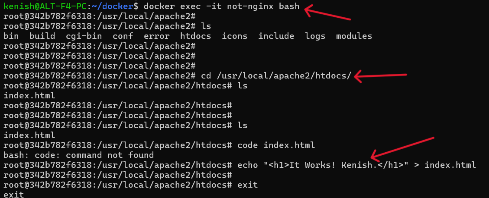
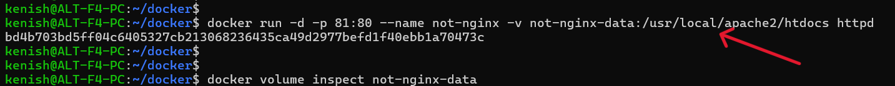
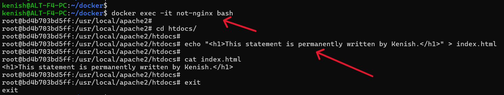
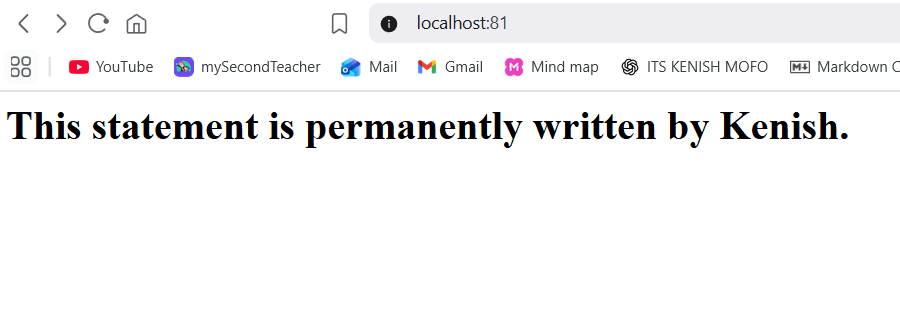
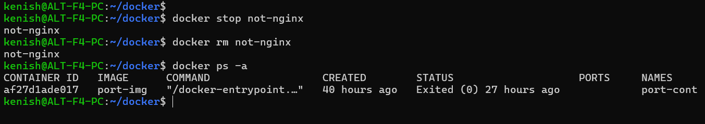
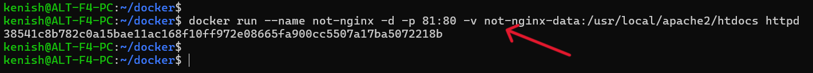

# Data Persistence in Containers

📌 **TASK**

- Pull a NGINX or httpd container.
- Browse the default page at http://localhost.
- Modify the default content.
- Stop and start the container and check if the changes persist.
- Remove the container and spin it up again to verify persistence.
- If content does not persist, explore ways to make it persistent.

---

### Step-1: Pull httpd image

    docker pull httpd

`docker pull` is a command that downloads a Docker image from a registry (such as Docker Hub) to the local machine.

---

### Step-2: Running a Docker Container

    docker run --name not-nginx -p 81:80 -d httpd 

This command initiates a Docker container with the following configurations.

- `--name not-nginx`: This assigns a custom name ("not-nginx") to the container.
- `-p 81:80`: This maps port 81 on the host machine to port 80 on the container enabling access to the container via port 81 on the host.
- `-d`: This runs the container in detached mode (in the background).
- `httpd`: Specifies that the container should use the httpd image (the Apache HTTP server).

---
### Verifying the Website

---

### Step-3: Alter the default content

    docker exec -it not-nginx bash 

The command `docker exec -it not-nginx bash` is used to open an `interactive terminal session (bash)` inside the running Docker container named `not-nginx`.

---
### Verifying the Website

---

**NOTE: Stopping and starting the container retains the content, but removing the container and spinning it again does not preserve the content.**

To make the content of the `httpd` container persistent even if the container is removed, Docker Volumes can be used. Volumes are managed by Docker and keep data outside the container's lifecycle. When the container is removed and recreated, the data in the volume remains intact.

---

### Step-4: Creating and Listing a Docker Volume

    docker volume create not-nginx-data

The command `docker volume create not-nginx-data` creates a named volume called not-nginx-data which is used to persist data outside the container.

---

### Step 5: Running the Container with Volume Mounting

    docker run -d -p 81:80 --name not-nginx -v not-nginx-data:/usr/local/apache2/htdocs httpd

This does the following:

- `-v not-nginx-data:/usr/local/apache2/htdocs`: Mounts the previously created Docker volume not-nginx-data to the container's Apache server directory (/usr/local/apache2/htdocs) to persist data.

---

### Step-6: Writing to the Volume and Verifying Persistence

---

### Step-7: Verifying the Persistent Content

---

### Step-8: Stopping and Removing the Container

---

### Step-9: Running a New Container with Persisted Data

---

### Step-10: Verifying Data Persistence After Recreating the Container

Upon accessing `http://localhost:81`, the message:

"This statement is permanently written by Kenish."

is displayed again, confirming that the changes made to the index.html file in the previous container are persisted in the Docker volume (not-nginx-data). The new container is using this persistent data, even after the old container was stopped and removed. This ensures that the data is preserved across container recreations.

---

