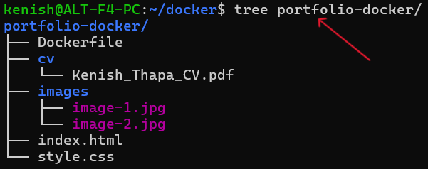
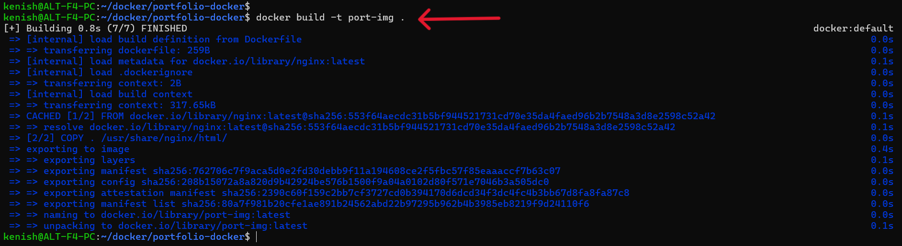
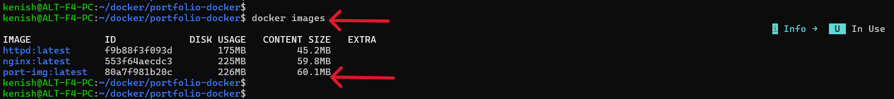
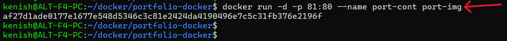
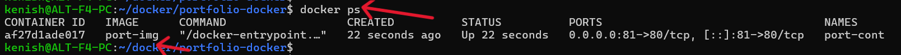
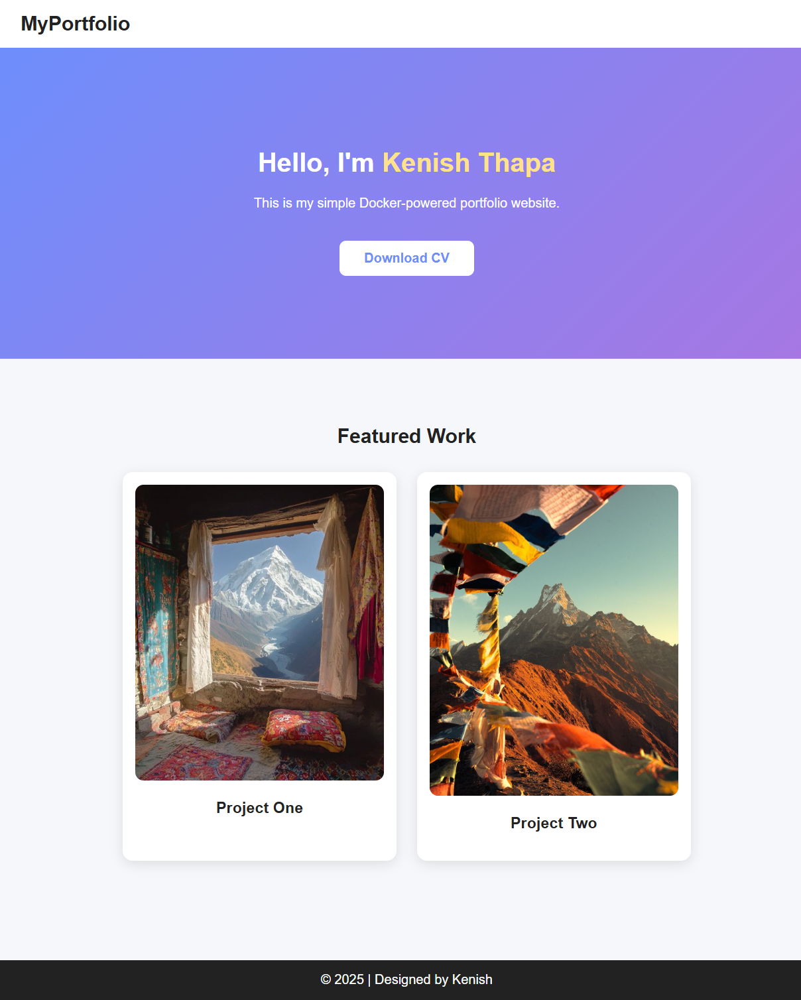

# Task: Create your own Docker image that runs a Portfolio website.

## 1. Project File Structure

The portfolio website should be organized in following structure:

    portfolio-docker/
    ├── Dockerfile
    ├── cv
    │   └── Kenish_Thapa_CV.pdf
    ├── images
    │   ├── image-1.jpg
    │   └── image-2.jpg
    ├── index.html
    └── style.css

### 1.1. Description

The `tree` command output illustrates the required directory layout for the portfolio Docker project. This structure allows NGINX to correctly serve all website components.

### 1.2. Purpose of Each Item

- Dockerfile – Defines instructions for building the Docker image.
- index.html – Main webpage for the portfolio.
- style.css – Stylesheet used to apply visual design.
- images/ – Contains image assets used within the portfolio.
- cv/ – Stores the downloadable CV file for visitors.

This structure ensures that all static files are properly copied into the NGINX container during the Docker build process.

---

## 2. Dockerfile Configuration

The Dockerfile defines how the container will be built and specifies the web server configuration required to host the portfolio website.

    # Start by using the official NGINX image
    FROM nginx:latest

    # Copy all the files from the current folder (.) into NGINX’s website folder
    COPY . /usr/share/nginx/html/

    # Expose port 80
    EXPOSE 80

### 2.1. Description

**1. FROM nginx:latest**

- Specifies the base image for the container.
- Uses the official NGINX image from Docker Hub.
- Provides a fully functional web server environment for serving static files.

**2. COPY . /usr/share/nginx/html/**

- Copies all project files from the current directory (.) into NGINX’s default web directory.
- /usr/share/nginx/html/ is where NGINX serves web content by default.
- Ensures HTML, CSS, images and CV files are available inside the container.

**3. EXPOSE 80**

- Informs Docker that the container will listen on port 80.
- Port 80 is the standard HTTP port used for web traffic.
- Allows the container to accept external requests when mapped using docker run -p.

This Dockerfile enables NGINX to serve the portfolio website as a static site inside a container.

---

## 3. Building the Docker Image

The screenshot shows the process of creating a Docker image using the docker build command inside the portfolio-docker directory.

### 3.1. Description

**1. docker build**

- Initiates the Docker image-building process.
- Reads the instructions defined in the Dockerfile.

**2. -t port-img**

- The -t flag assigns a tag (name) to the image.
- port-img becomes the image name making it easy to reference later when running the container.

**3. . (dot)**

- Represents the build context.
- Indicates that Docker should use the current directory as the source for the build.
- Includes the Dockerfile and all website files required by NGINX.

---

## 4. Viewing Available Docker Images

The screenshot displays the output of the command used to list all Docker images stored on the system.

### 4.1. Command Used

    docker images

### 4.2. Description 

- Lists all Docker images currently available on the local machine.
- Shows information such as the image name, image ID, size and tags.
- Useful for verifying whether a newly built image exists and is ready to be used.

---

## 5. Running the Docker Container

The screenshot shows the command used to start a container from the previously built portfolio image.

### 5.1. Command Used

    docker run -d -p 81:80 --name port-cont port-img

### 5.2. Description 

**1. docker run**

- Creates and starts a new container from a specified image.

**2. -d**

- Runs the container in detached mode (in the background).
- Allows the terminal to remain free while the container continues running.

**3. -p 81:80**

- Maps port 81 on the host machine to port 80 inside the container.
- Port 80 is the default web server port used by NGINX.
- Accessing http://localhost:81 opens the portfolio website.

**4. --name port-cont**

- Assigns a custom name (port-cont) to the container.
- Makes it easier to manage (start, stop, remove) without using container IDs.

**5. port-img**

- Specifies the Docker image from which the container should be created.
- port-img is the custom portfolio image built earlier.

---

## 6. Checking Running Docker Containers

The screenshot shows the output of the docker ps command, which is used to view currently active containers.

### 6.1. Command Used

    docker ps

---

## 7. Accessing the Portfolio Website in a Browser

The screenshot displays the portfolio website successfully running inside the Docker container and rendered in a web browser.

---