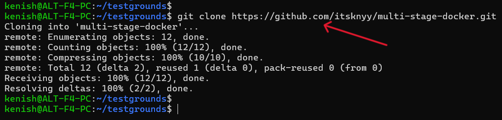
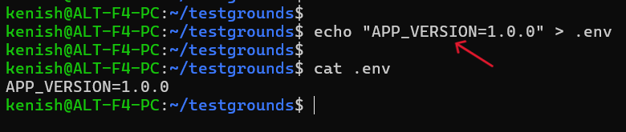
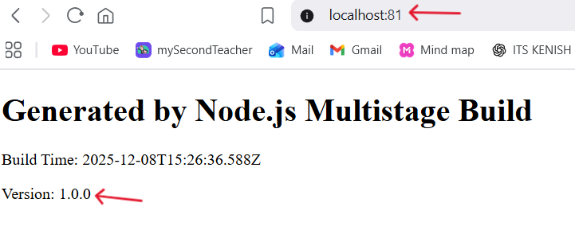
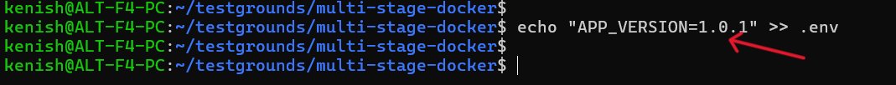
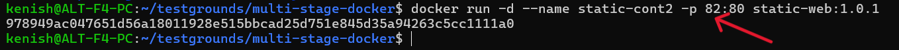
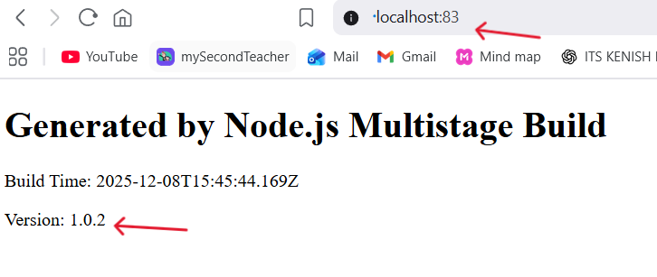
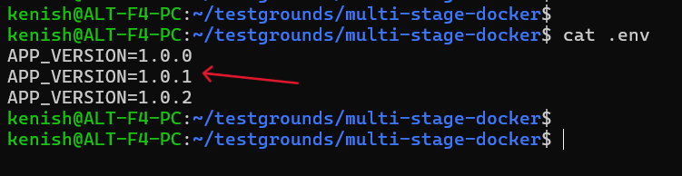

# Containerize NodeJS App with Multi-Stage Docker Build

📌**TASK**

- Fork or copy GitHub - adex-devops-bootcamp/multi-stage-docker 
- Generate a lighweight Dockerfile
- Put screenshots in the comments or documentation of building the app with different version tags (Hint: .env)

---

### Step-1: Clone the Multi-Stage Docker Repository

---

### Step-2: Create a .env File to Store the App Version

---

### Step-3: Creating a Dockerfile

    # STAGE1: BUILDER

    # Use a lightweight Node.js image for building the project
    FROM node:18-alpine AS builder

    # Set the working directory inside the container
    WORKDIR /myapp

    # Copy only package.json first (this helps Docker cache dependencies)
    COPY package.json .

    # Install Node.js dependencies inside the container
    RUN npm install

    # COPY .env so dotenv can read it inside the build stage
    COPY .env .env

    # Copy remaining project files
    COPY . .

    RUN mkdir -p dist

    # Run the build script
    RUN npm run build

    # STAGE2: PRODUCTION STAGE

    FROM nginx:1.29-alpine

    RUN rm -f /usr/share/nginx/html/*

    # Copy index.html produced in the builder stage into Nginx's web root
    COPY --from=builder /myapp/dist/index.html /usr/share/nginx/html

    EXPOSE 80

---

### Step-4: Build the Docker Image Using Multi-Stage Dockerfile

---

### Step-5: Run the Docker Container from the Built Image

---
### Verifying the Website

---

### Step-6: Update the Application Version in the .env File

---

### Step-7: Build a New Docker Image with Updated Version (1.0.1)

---

### Step-8: Run a New Container Using the Version 1.0.1 Image

---

### Verify the New Version (1.0.1)

---

**NOTE:** Just like the previous update from version 1.0.0 to 1.0.1, the next upgrade to version 1.0.2 follows the same steps - modify the .env file with the new version number, build a new Docker image using that version tag and deploy a fresh container mapped to a different port for testing.

---

### Verify the New Version (1.0.2)

---

### Step-9: Confirm the Version History Stored in the .env File

---
