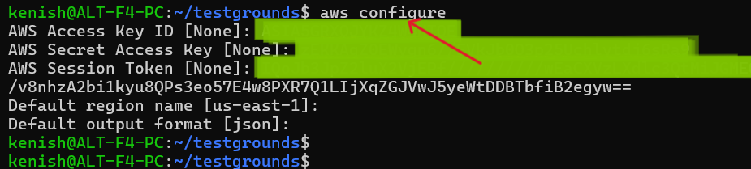
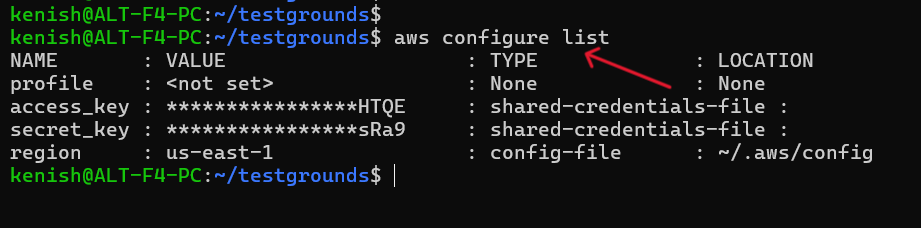

## Task: Install and Configure AWS CLI and list created S3 Bucket(s); and harden the credentials

### STEP-1: Download & Install AWS CLI (Linux)
    curl "https://awscli.amazonaws.com/awscli-exe-linux-x86_64.zip" -o "awscliv2.zip"
    unzip awscliv2.zip
    sudo ./aws/install

    aws --version

---

### STEP-2: Configure AWS CLI
After installing AWS CLI, run:

    aws configure

This command asks for:

- AWS Access Key ID
- AWS Secret Access Key
- AWS Session Token
- Default region name (e.g., us-east-1)
- Default output format (json)

### STEP-3: Checking AWS CLI Configuration
To verify that AWS CLI has been configured correctly, the following command is used:

    aws configure list

---

### STEP-4: Verifying AWS CLI Authentication
To confirm that AWS CLI is using valid credentials, the following command is executed:

    aws sts get-caller-identity

This command returns three key pieces of information:

- UserId – Identifies the temporary session user from the lab environment
- Account – The AWS account ID being accessed
- Arn – Shows the Amazon Resource Name of the IAM role being used

---

### STEP-5: Creating and Listing an S3 Bucket 
To create a new S3 bucket using AWS CLI, the following command is used:

    aws s3 mb s3://kenish-test-bucket

- mb stands for make bucket.
- The output make_bucket: kenish-test-bucket confirms that the bucket was created successfully.

Next, to verify that the bucket exists, the following command is executed:

    aws s3 ls

- This lists all buckets in the account.
- The output shows the newly created bucket kenish-test-bucket along with its creation date and time.

This confirms that the bucket was successfully created and is now accessible through AWS CLI.

---

## Credential Hardening

Credential hardening refers to the security practices used to protect AWS access keys from being exposed, misused or stolen. Since AWS CLI relies on authentication keys, it is important to follow best practices to ensure the environment remains secure.

1. Never expose credentials

    AWS Access Key, Secret Key and Session Token must not be shared, posted online, included in code or shown in screenshots. Exposing these values can allow unauthorized users to access your AWS resources.

2. Use temporary session tokens

    In lab environments, AWS provides temporary STS credentials that expire automatically. This limits the risk even if a key is exposed. Temporary credentials are safer than permanent IAM access keys.

3. Follow Least Privilege Access

    Only give the minimum permissions required. 

4. Enable MFA for console logins

    Multi-Factor Authentication (MFA) adds an extra layer of protection, preventing unauthorized access even if a password is compromised.

---