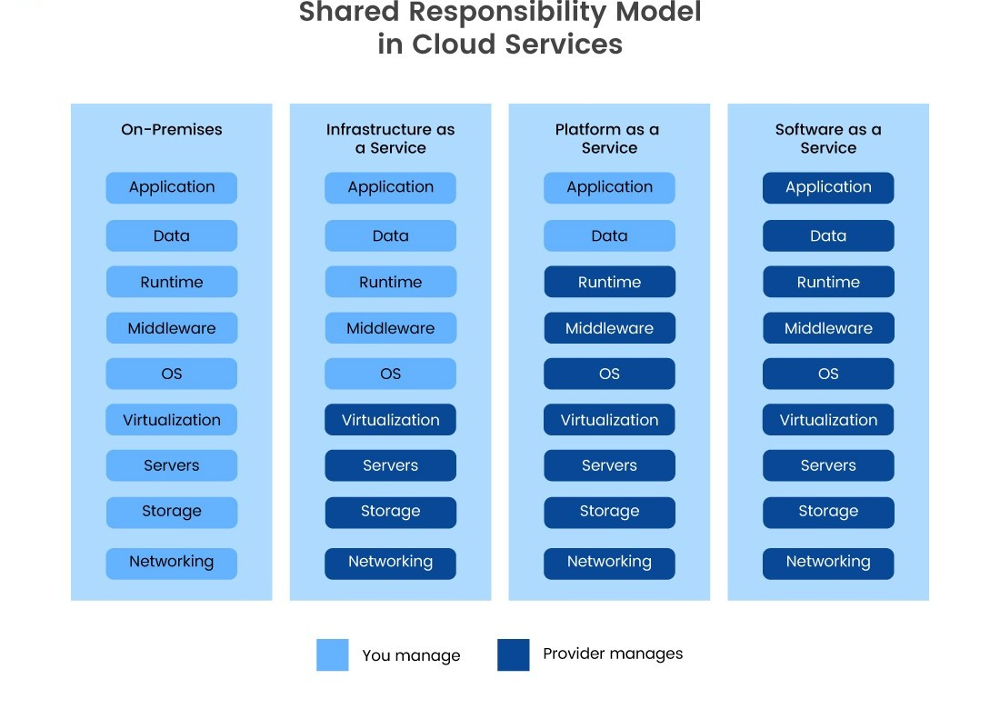

# 1. Cloud Service Models

## a. IaaS (Infrastructure as a Service)
- Provides virtual servers, storage and networking
- User manages OS, applications and data
- Examples: AWS EC2, Azure VM, Google Compute Engine

## b. PaaS (Platform as a Service)
- Provides platform to develop and deploy applications
- User manages application code and data only
- Examples: Google App Engine, AWS Elastic Beanstalk, Heroku

## c. SaaS (Software as a Service)
- Provides ready-to-use software over the internet
- User only uses the application
- Examples: Gmail, Microsoft 365

---

# 2. Responsibility Table

---

**Summary:**

- IaaS: Provides infrastructure, full control over OS and apps.
- PaaS: Provides platform for app development without managing servers.
- SaaS: Provides ready-to-use software over the internet.

---