# Task: PaaS - Deploy an app that displays version in webpage in AWS ElasticBean

This walkthrough demonstrates how a simple web application that displays its version number on a webpage can be deployed using **AWS Elastic Beanstalk (PaaS)**. The deployment is performed in two phases:

1. AWS Console (first deployment)
2. EB CLI (second deployment)
---
## Part A - Creating a Simple “Version Page” Application 

This section describes the creation of a minimal Node.js web application that displays an application version on a webpage.

### A1. Project Directory Setup 

    mkdir eb-version-app
    cd eb-version-app

This directory serves as the root of the Elastic Beanstalk application.

### A2. Creating the Application Server (server.js)

A simple HTTP server is implemented using Node.js’s built-in http module.

    const http = require("http");

    const PORT = process.env.PORT || 8080;
    const VERSION = process.env.APP_VERSION || "v1.0.0";

    http.createServer((req, res) => {
    res.writeHead(200, { "Content-Type": "text/html" });
    res.end(`<h1>Elastic Beanstalk App</h1>
Version: <b>${VERSION}</b>
`);
    }).listen(PORT);

### A3. Defining Application Metadata (package.json)

A package.json file is created to define application metadata and startup behavior.

    {
    "name": "eb-version-app",
    "version": "1.0.0",
    "main": "server.js",
    "scripts": {
        "start": "node server.js"
    }
    }

### A4. Packaging the Application

At this stage, the application source code is packaged into a ZIP archive, which is the required format for deployment to AWS Elastic Beanstalk.

    zip app.zip package.json server.js

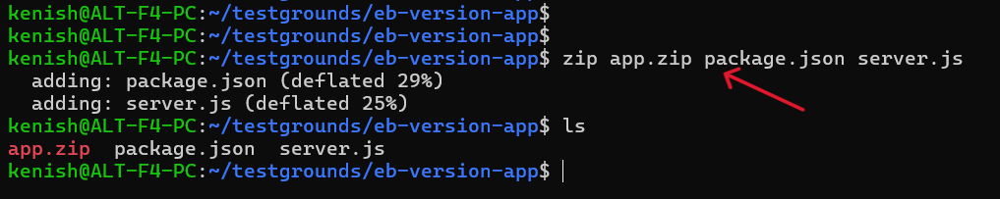

---

## Part B - Deploy using AWS Console

This section describes the initial deployment of the versioned Node.js application using the AWS Elastic Beanstalk Management Console, where the application environment and required infrastructure are automatically created.

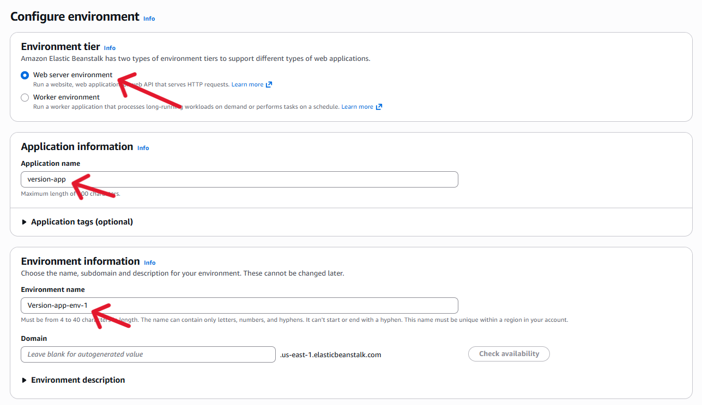
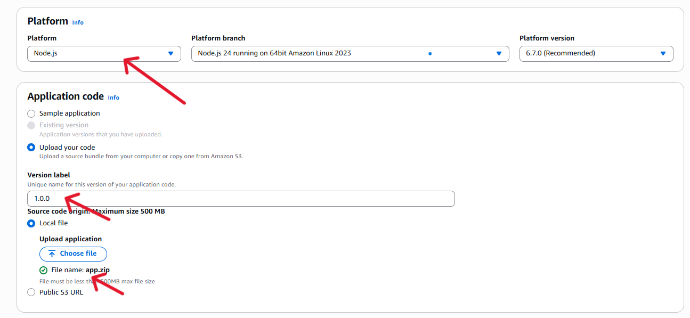
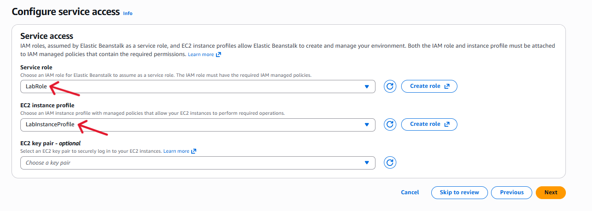

After proceeding, AWS provisions the infrastructure and deploys the uploaded application version.

### B1. Environment Launched

Opening the domain URL displays the version page, confirming a successful deployment.

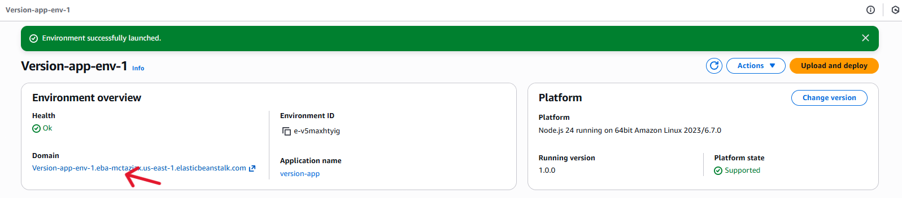
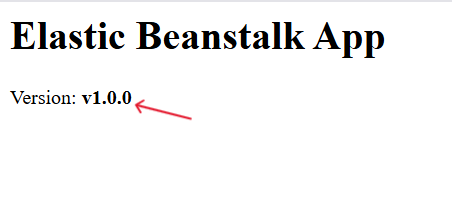

---

## Part C - Deploy using EB CLI (Update version)

### C1. Configure AWS

    aws configure

(Access key, secret, region, output format)

### C2. Verify AWS Identity

    aws sts get-caller-identity

It shows:
 - Account ID → AWS account being used
 - User/Role ARN → Identity (IAM role or user) currently active

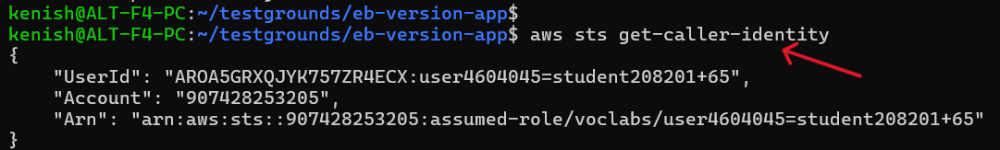

### C3. Install EB CLI

The `Elastic Beanstalk Command Line Interface` (EB CLI) is installed to manage Elastic Beanstalk applications from the terminal.

[(Setting up the EB CLI)](https://docs.aws.amazon.com/elasticbeanstalk/latest/dg/eb-cli3.html)

### C4. Initialize Elastic Beanstalk Application

    eb init

1. The EB CLI initializes the current project for Elastic Beanstalk.
2. It prompts for a default AWS region (selected to match the existing environment).
3. The configuration links:
    - This local project
    - The AWS account
    - The Elastic Beanstalk application

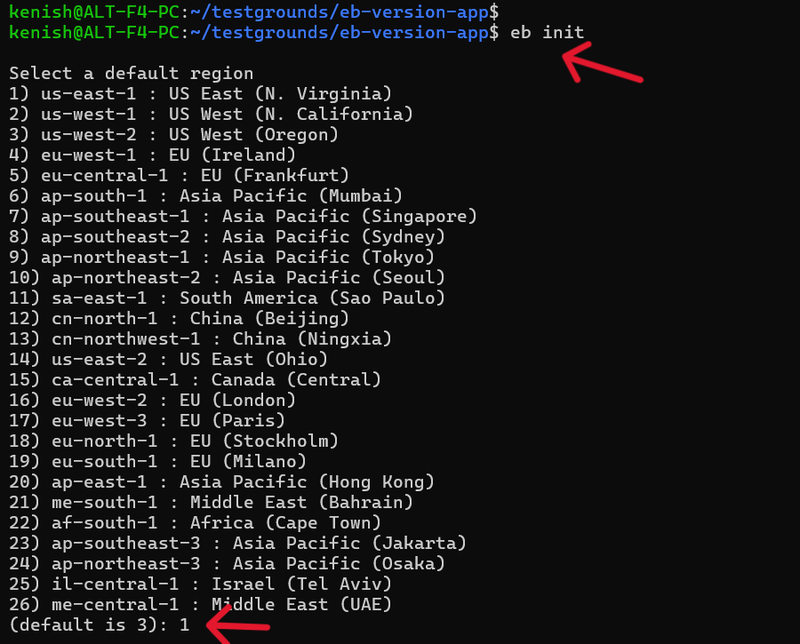
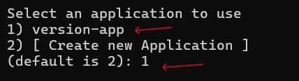

After this step, the project is ready for deployment and version updates using the EB CLI.

### C5. List Elastic Beanstalk Environments

    eb list 

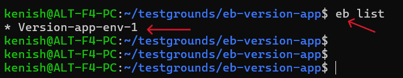

1. Displays all Elastic Beanstalk environments linked to this application.
2. The * symbol marks the currently active environment.
3. Version-app-env-1 is confirmed as the target environment for deployments.

This verifies that the EB CLI is correctly connected to the existing Elastic Beanstalk environment.

**NOTE: The application version shown on the webpage is changed in the server.js file.**

### C6. Deploy New Version Using EB CLI

    eb deploy --label 1.0.1

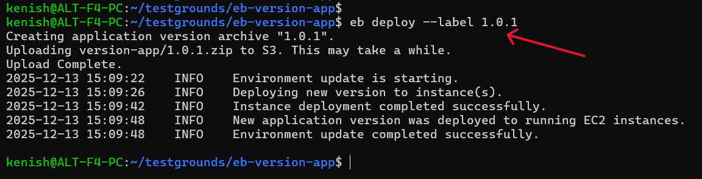
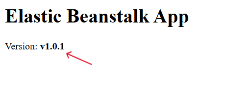

### C7. Check Deployment Status

    eb status

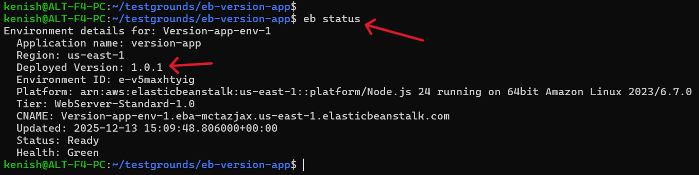

1. Displays the current state of the Elastic Beanstalk environment.
2. Confirms the deployed application version (1.0.1).
3. Shows the environment is Ready with Health: Green.
4. Confirms the correct region, platform and public URL (CNAME).

---

## Part D - Rollback to Previous Version (EB CLI)

A rollback is performed when a previously deployed application version needs to be restored.

### D1. Check all app versions

    eb appversion

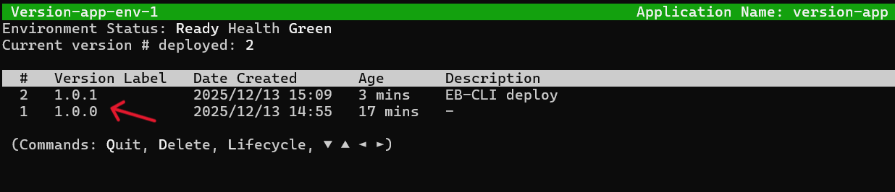

### D2. Rollback Using EB CLI

    eb deploy --version 1.0.0

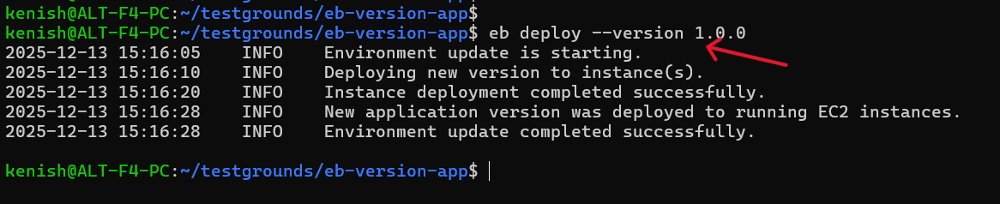

### D3. Rollback Verification

    eb status

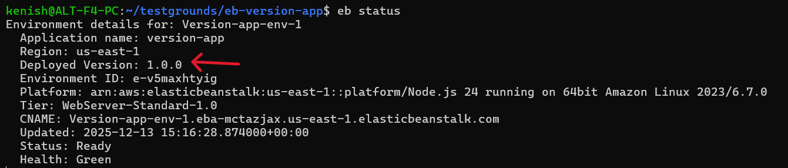

--- 

## Part E - Terminate Elastic Beanstalk Environment

    eb terminate

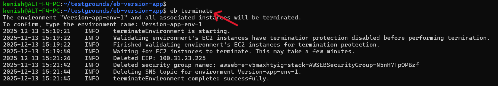

The Elastic Beanstalk environment is terminated to cleanly shut down all running resources after testing and validation are complete.

**Reasons:**
1. To stop AWS charges for EC2, load balancer, and networking resources
2. To avoid unused or orphaned infrastructure
3. To demonstrate full application lifecycle management (deploy → update → rollback → delete)
4. To keep the AWS account clean for future deployments

Termination removes the running environment only, while application versions and configuration history can still be reused later.

---