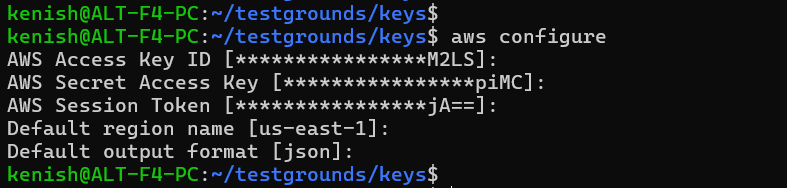
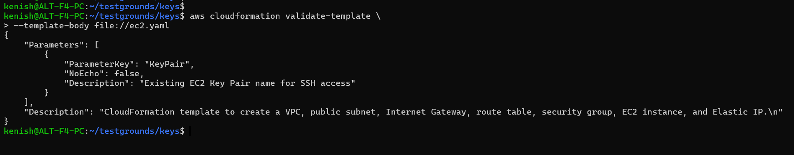
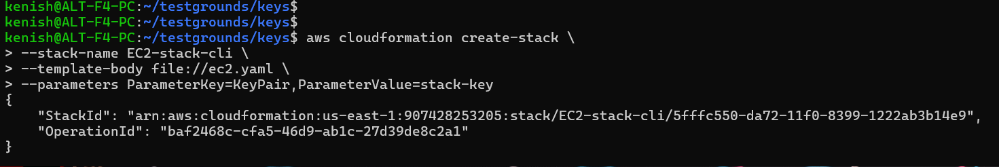
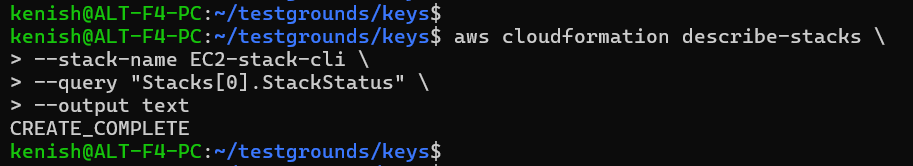
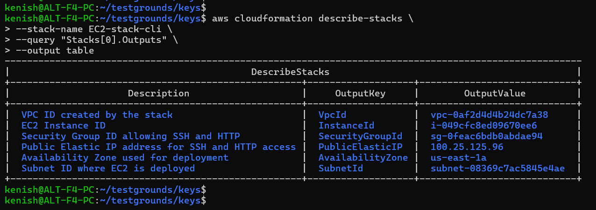
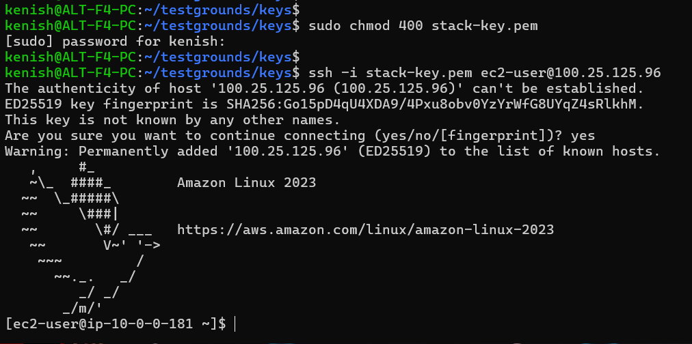
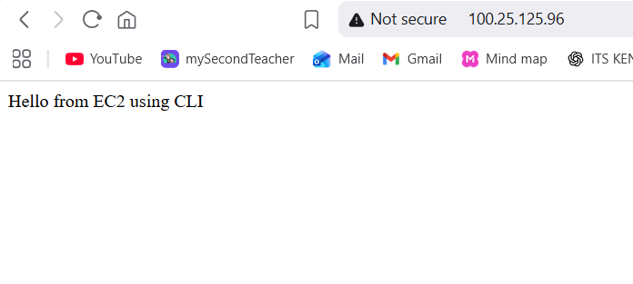

## CloudFormation Deployment via CLI

### Step-1: Configure AWS credentials

---

### Step-2: Validate CloudFormation template

    aws cloudformation validate-template \
        --template-body file://ec2.yaml

**What this does:**
- Validates a CloudFormation template
- Checks syntax, structure, and parameters
- Does not create any AWS resources

**Output shows:**
- Detected parameters (e.g., KeyPair)
- Confirmation that the template is valid
- The template description

---

### Step-3: Create the CloudFormation stack

    aws cloudformation create-stack \
        --stack-name EC2-stack-cli \
        --template-body file://ec2.yaml \
        --parameters ParameterKey=KeyPair,ParameterValue=stack-key

- The command is used to create AWS infrastructure using CloudFormation
- The file ec2.yaml contains the infrastructure definition (IaC template)
- A Key Pair name (stack-key) is passed as a parameter for EC2 SSH access
- AWS returns a StackId, confirming the request was accepted
- After this, AWS automatically provisions all defined resources
- The process runs in the background until the stack reaches CREATE_COMPLETE

---

### Step-4: Check the status of a CloudFormation stack

    aws cloudformation describe-stacks \
        --stack-name EC2-stack-cli \
        --query "Stacks[0].StackStatus" \
        --output text

- `describe-stacks` retrieves stack details
- `--query "Stacks[0].StackStatus"` filters only the status
    - Stacks → list of stacks returned
    - [0] → first stack in the list
    - StackStatus → current state of that stack
- `--output text` shows a clean, readable result

---

### Step-5: Get Elastic IP

    aws cloudformation describe-stacks \
        --stack-name EC2-stack-cli \
        --query "Stacks[0].Outputs" \
        --output table

- `Outputs` are values exported by the template after creation

---

### Step-6: SSH into EC2

    chmod 400 stack-key.pem
    ssh -i stack-key.pem ec2-user@<ElasticIP>

---

### Step-7: Install Apache via CLI

    sudo dnf install httpd -y
    sudo systemctl start httpd
    sudo systemctl enable httpd

---

### Step-8: Create a test webpage

    echo "Hello from EC2 via CLI" | sudo tee /var/www/html/index.html

`sudo tee` is used to write piped output to a file with root permissions when normal redirection (> or >>) is not allowed.

---

### Step-9: Test HTTP from browser

    http://<ElasticIP>
    

---

