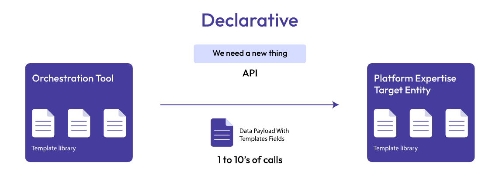

# Key Concepts in IaC

## 1. Declarative vs Imperative

### Declarative (What you want):
- Users describe the desired end state
- The tool figures out how to achieve it
- Example: Terraform, AWS CloudFormation
- "I want an S3 bucket with these properties"

---

---

### Imperative (How to do it):
- Users specify the exact steps to take
- More procedural approach
- Example: Ansible (can be both)
- "First create this, then configure that, then start this service"

---

--- 

## 2. Drift Detection

- What it is: When infrastructure changes outside of IaC (manual modifications)
- Why it matters: Infrastructure no longer matches the code
- Solution: Tools detect these differences and can correct them

---

## 3. State Management

- Tools track what infrastructure they've created
- Helps identify what exists vs what should exist
- Essential for managing updates and deletions

---

# Four Types of IaC

## 1. Configuration Management

Purpose: Installing and managing software on existing servers  
What it does:
- Ensures all servers are consistently configured
- Manages software installations and updates
- Configures applications and services
- Examples: Ansible
- Use case: "Make sure all web servers have the same version of Apache installed and configured"

## 2. Server Templating

Purpose: Creating reusable templates that define a server's complete configuration  
What it does:
- Builds images or templates of fully-configured servers
- Allows users to spin up identical servers quickly
- Packages the entire server environment
- Examples: Docker
- Use case: "Create a Docker image with Node.js, Nginx, and the application pre-installed, ready to run"

## 3. Orchestration

Purpose: Managing the interconnections and interactions between different infrastructure components  
What it does:
- Coordinates multiple containers or services
- Manages complex environments with many moving parts
- Handles scaling, networking, and service discovery
- Examples: Kubernetes
- Use case: "Run 5 copies of the web app, 2 database containers, and automatically balance traffic between them"

## 4. Provisioning

Purpose: Initial setup of servers and infrastructure components  
What it does:
- Creates the actual infrastructure resources (servers, networks, storage)
- Sets up the foundation before software is installed
- Manages cloud resources
- Examples: Terraform, AWS CloudFormation
- Use case: "Create 3 EC2 instances, 1 RDS database, and a VPC with proper networking"

---