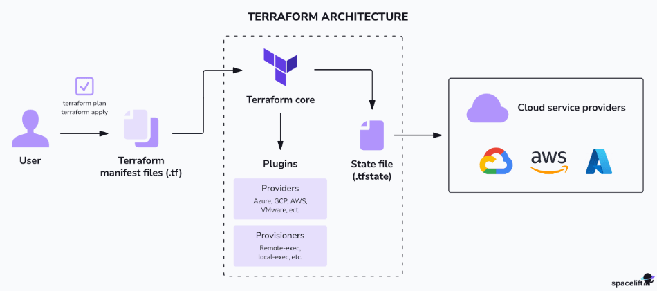

# Terraform

Terraform is a tool used to create, manage and update IT infrastructure automatically using code.

---

## Architecture

**1. Terraform CLI**
- Runs in a local machine or in a CI/CD pipeline
- Used to execute Terraform commands (`init`, `plan`, `apply`, etc.)

**2. Terraform Core**
- The main engine of terraform
- Reads the configuration files (`.tf`)
- Builds the execution plan
- Manages resource lifecycle and state

**3. Providers**
- Plugins that communicate with external APIs
- Used to create and manage resources (AWS, Azure, GCP, VMware, etc.)

**4. Terraform State**
- Keeps tracks of infrastruture created by Terraform
- Can be:
    - Local: stored as `terraform.tfstate`
    - Remote: stored in backends like S3, Terraform Cloud, etc.

Below is the Terraform architecture diagram:

  

[image-source: spacelift](https://spacelift.io/blog/terraform-architecture)

---

### Core Terraform Commands

**1. terraform init**  
**What it does:** Prepares the project  
- Initilizes the working directory
- Downloads modules and providers
- Configure the backend
- Creates `.terraform/` folder and `.terraform.lock.hcl` file
- Does not create infrastructure yet

**2. terraform plan**  
**What it does:** Shows what will change
- Compares code with current state
- Shows the preview before making changes
- Optional: Users can save the plan with `-out` flag for later use

**3. terraform apply**  
**What it does:** Actually creates/modifies infrastructure
- Executes the plan
- Creates or updates real cloud resources
- Updates the `.tfstate` file after success

**4. terraform destroy**  
**What it does:** Deletes everything
- Removes all resources tracked in the state file
- Used for cleanup

---

### How Terraform Works: The Three-Way Comparison  
Terraform always compares three things:
1. Desired State --> The user's code (`.tf` files)
2. Recorded State --> What Terraform remembers (`.tfstate` files)
3. Live/Running Resources --> What actually exist in the cloud (Checked via API)

This comparison helps Terraform figure out what needs to be created, updated, or deleted.

---
