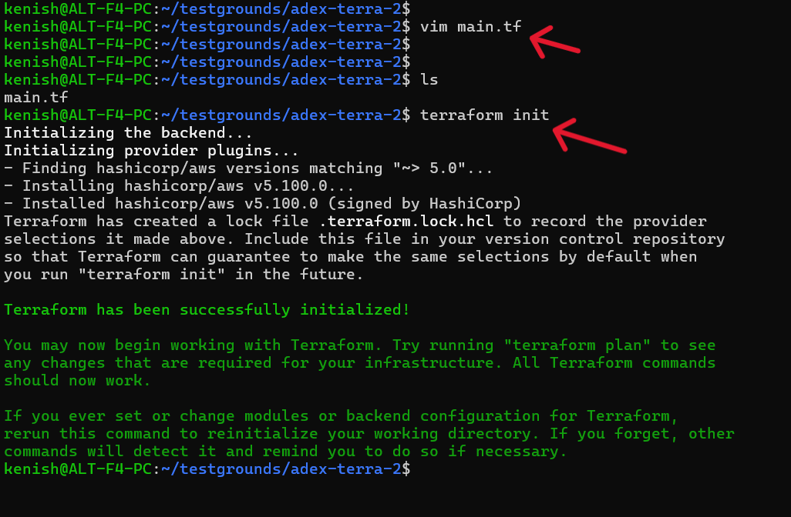
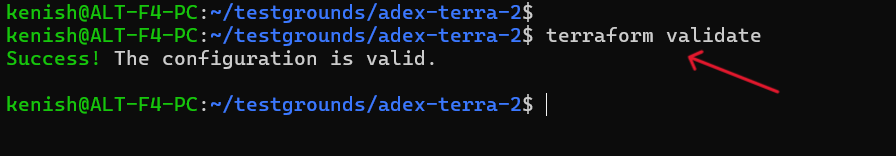
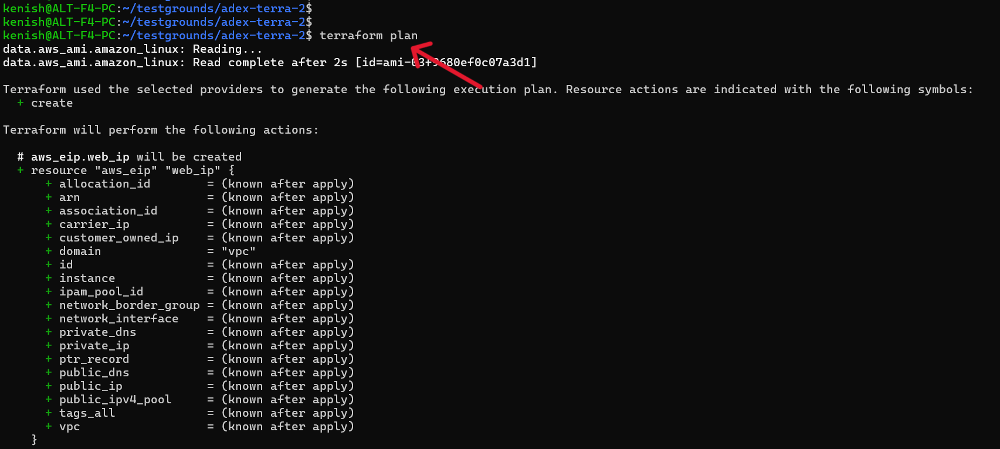
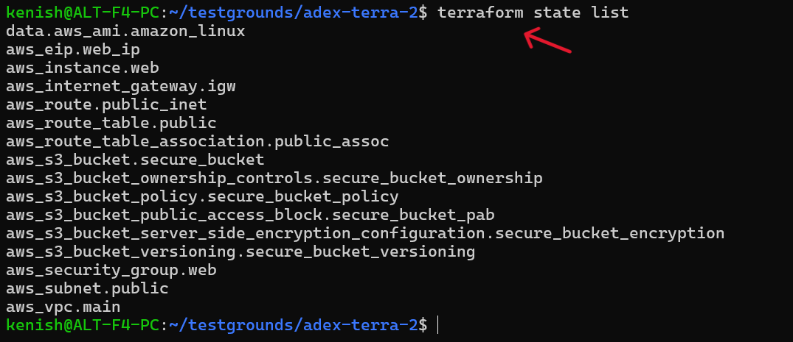

# TASK: Transform EC2 and S3 CloudFormation Templates into Terraform code

---
## STEP 1: terraform init

- `main.tf` [could be found here](https://github.com/itsknyy/devops-quest/blob/main/week-4/day-1/assignment/ec2-s3.tf/ec2-s3-deploy.tf) 
- `terraform init` is the command that sets up Terraform for the first time in a project.

---

## STEP 2: terraform validate

- `terraform validate` checks Terraform files to make sure the syntax is correct and there are no errors.

---

## STEP 3: terraform plan

- `terraform plan` shows what Terraform is going to create, change, or delete before it actually does anything.

---

## STEP 4: terraform apply -auto-approve

- `terraform apply` actually creates the resources shown in the plan.

---

## STEP 5: terraform state list

- `terraform state list` shows all the resources Terraform is currently managing.

---