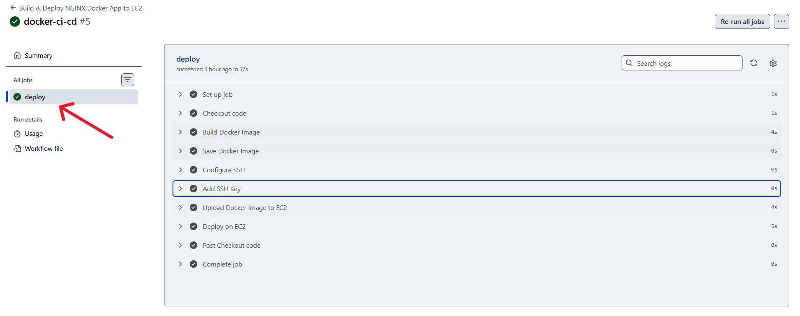
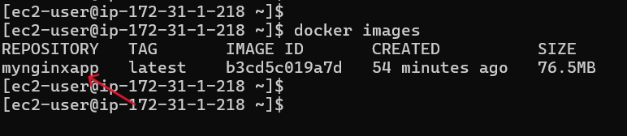
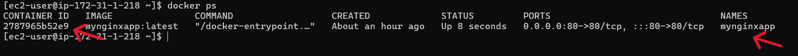
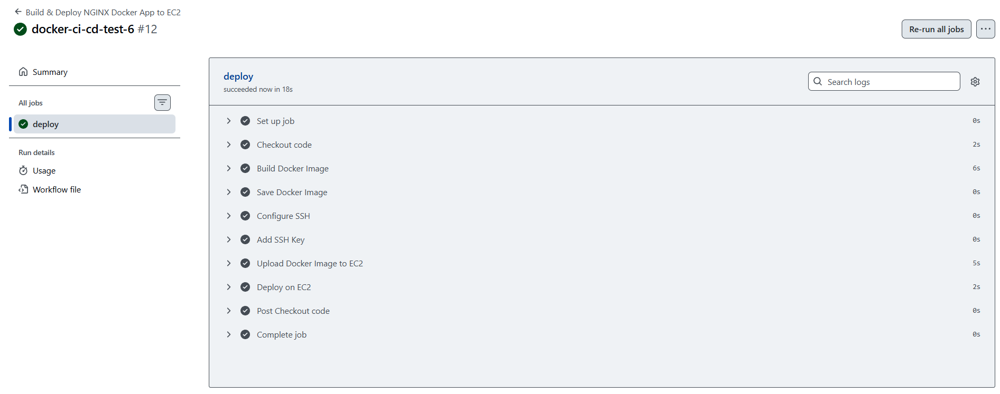
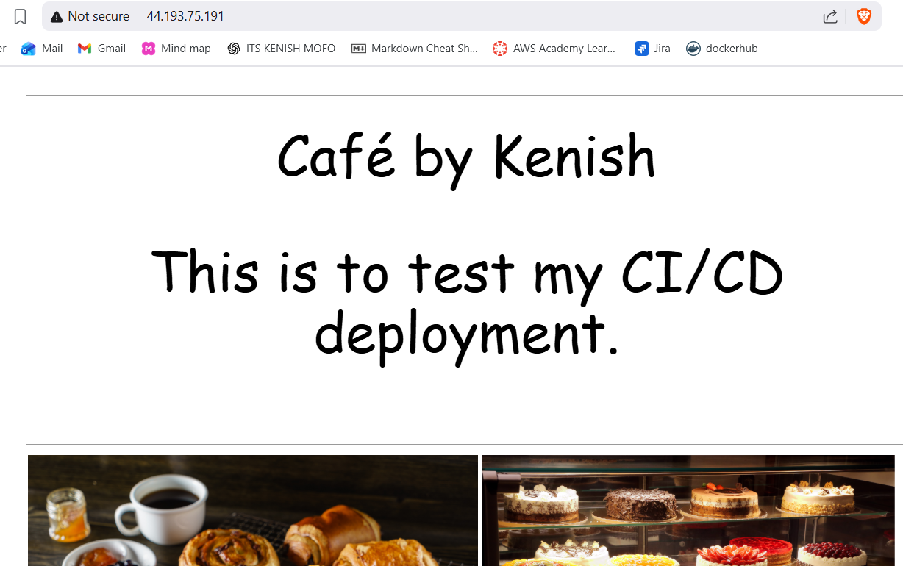

# TASK: Write a CI/CD in GitHub Actions that triggers when code is changed in your repo. It should build a docker image and deploy that in EC2.

**Overview**

This document describes how to automatically deploy a Dockerized application to an EC2 instance using GitHub Actions. Each push to the main branch triggers a build and deployment to the server.

## 1. Create an EC2 Instance

1. Choose **Amazon Linux AMI**
2. Instance type: **t3.micro**
3. Create/choose key pair (PEM)
4. Allow:
    - SSH (22)
    - HTTP (80)
5. Launch the instance

## 2. Install Docker

1. SSH into the server
2. Install docker
    
        sudo dnf update -y
        sudo dnf install docker -y
        sudo systemctl start docker
        sudo usermod -aG docker ec2-user

## 3. Prepare GitHub

1. Add secrets: base64 encoded KEY
2. Add variable: EC2 Public IP

## 4. Add Dockerfile

    FROM nginx:alpine

    RUN rm -rf /usr/share/nginx/html/*

    COPY . /usr/share/nginx/html/

    EXPOSE 80

## 5. Add GitHub Actions Workflow

    name: Build & Deploy NGINX Docker App to EC2

    on:
    push:
        branches:
        - main

    jobs:
    deploy:
        runs-on: ubuntu-latest
        env:
        SERVER_IP: ${{ vars.SERVER_IP }}

        steps:
        # 1. Checkout repo
        - name: Checkout code
            uses: actions/checkout@v4

        # 2. Build Docker Image
        - name: Build Docker Image
            run: |
            docker build -t mynginxapp:latest .

        # 3. Save Docker Image
        - name: Save Docker Image
            run: |
            docker save mynginxapp:latest -o mynginxapp.tar

        # 4. Prepare SSH & disable host key checking
        - name: Configure SSH
            run: |
            mkdir -p ~/.ssh
            chmod 700 ~/.ssh
            echo -e "Host *\n\tStrictHostKeyChecking no\n\n" > ~/.ssh/config
            chmod 600 ~/.ssh/config

        # 5. Add private key from GitHub Secrets
        - name: Add SSH Key
            env:
            SSH_KEY64: ${{ secrets.SSH_KEY64 }}
            run: |
            echo "$SSH_KEY64" | base64 -d > mykey.pem
            chmod 400 mykey.pem

        # 6. Upload Docker Image (scp)
        - name: Upload Docker Image to EC2
            run: |
            scp -i mykey.pem mynginxapp.tar ec2-user@$SERVER_IP:/home/ec2-user/

        # 7. Load & run container on EC2
        - name: Deploy on EC2
            run: |
            ssh -i mykey.pem ec2-user@$SERVER_IP "
                docker load -i mynginxapp.tar &&
                docker stop mynginxapp || true &&
                docker rm mynginxapp || true &&
                docker run -d -p 80:80 --name mynginxapp mynginxapp:latest
          "

## 6. Test the CI/CD Setup

**1. Push code -> GitHub Actions runs automatically.** 

**2. GitHub Actions Triggered**

---
**2. Docker Image Loaded on EC2**

---
**3. Docker Container Running**

---
**4. Application Running in Browser**

---

## 7. Test the update

**1. GitHub Actions Triggered**

---
**2. Updated Application Running in Browser**

---