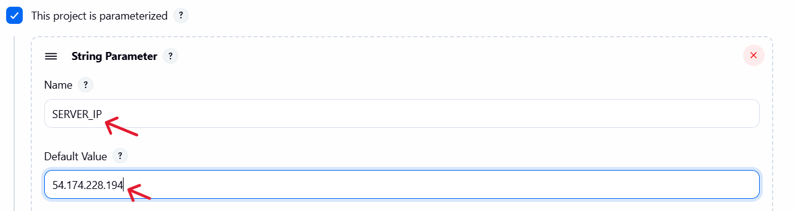
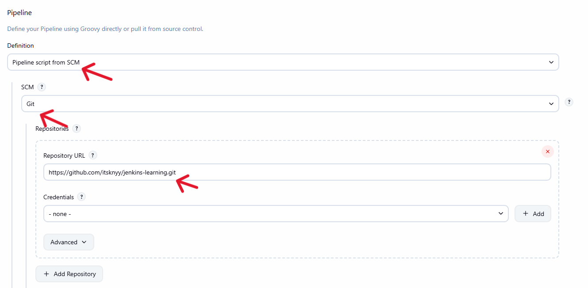
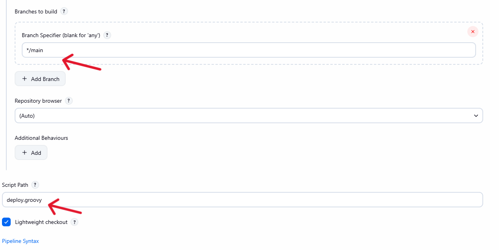

# Jenkins SSH Deployment Pipeline

This document explains how to set up and run a Jenkins pipeline that deploys code to a remote EC2 server using SSH and Git.

## 1. Prerequisites

Before setting up the pipeline, ensure you have the following:

### 1.1. Jenkins Installed

- Jenkins server up and running

### 1.2. Git Installed on Remote Server

    sudo yum install git -y

### 1.3. NGINX Installed

- Deployment directory in the pipeline:  

        usr/share/nginx/html

### 1.4. Clone Git repo

### 1.5. Fix permissions

    sudo chown -R ec2-user:ec2-user /usr/share/nginx/html

### 1.6. SSH Access

- SSH private key for the EC2 instance.

## 2. Prepare the SSH Key for Jenkins

### 2.1. Convert SSH key to Base64

- On local machine:

        base64 mykey.pem > mykey.pem.b64

### 2.2 Add the Base64 Key to Jenkins Credentials

1. Go to Jenkins Dashboard
2. Open Manage Jenkins -> Credentials
3. Select a domain (usually “global”)
4. Click Add Credentials
5. Choose:
    - Kind: Secret Text
    - ID: SSH_KEY64
    - Secret: paste contents of mykey.pem.b64

SSH key is now stored securely.

# 3. Create Pipeline

**1. Go to New Item -> Pipeline**

**2. Name it (example: SSH-Deploy-Pipeline)**

**3. Choose Pipeline**

**4. Tick `This project is parameterized` -> Add Parameter**

**5. Scroll down to the Pipeline Script section**

**6. Save**

---

## 4. Run the Pipeline

### 4.1. Start the job

1. Click Build with Parameters
2. Enter or confirm:
    - SERVER_IP (default shown automatically)
3. Click Build

### 4.2. Deployment Done

- If successful, the EC2 server will now have the latest code.

---