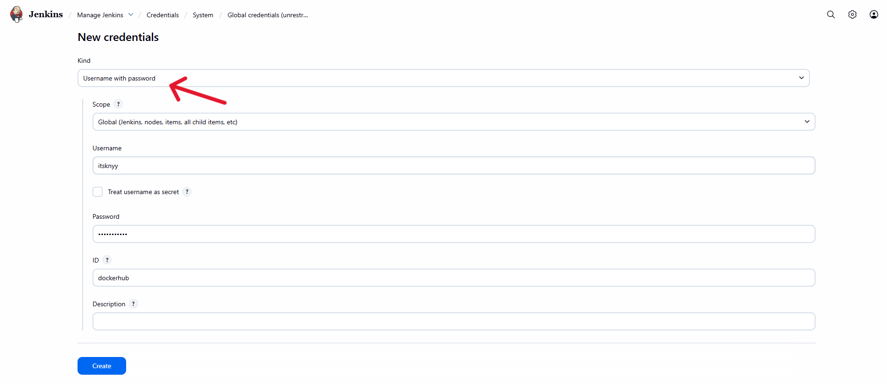
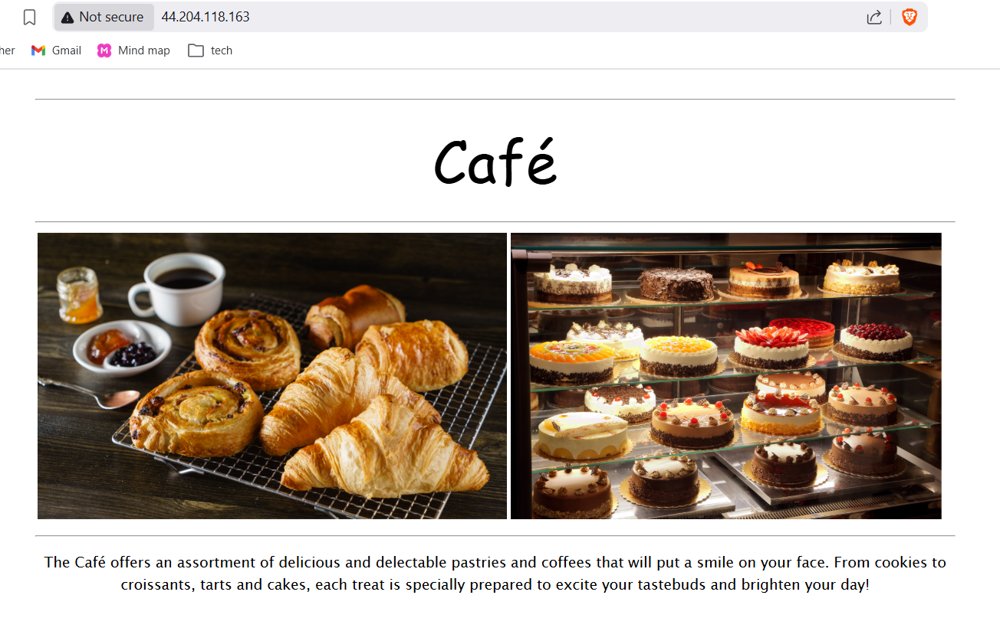
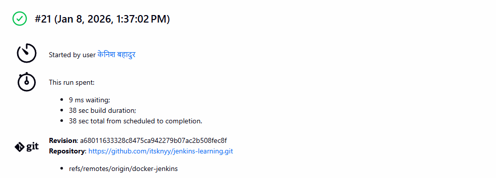

# Jenkins CI/CD Pipeline: Docker Build, Push and EC2 Deployment

## 1. Task Overview

The objective of this task is to create a **Jenkins Declarative Pipeline** that automates the following workflow:

1. Build a Docker image from application source code
2. Push the Docker image to a Container Registry (Docker Hub)
3. Connect to an AWS EC2 instance using SSH
4. Pull the latest Docker image on EC2
5. Run the application using Docker Compose

This pipeline enables a complete **CI/CD flow**, ensuring that every change pushed to the repository can be automatically built and deployed.

---

## 2. Tools & Technologies Used

* **Jenkins** – CI/CD automation server
* **Docker** – Containerization platform
* **Docker Hub** – Container Registry
* **AWS EC2** – Deployment server
* **Docker Compose** – Container orchestration on EC2
* **SSH** – Secure remote access

---

## 3. Prerequisites & Basic Setup

Before running this Jenkins pipeline, the following prerequisites must be met:

### 3.1 Docker Service

* Docker must be **installed and running** on the Jenkins server (local machine)

### 3.2 Jenkins User Docker Permissions

Jenkins must have permission to execute Docker commands.

* Add the Jenkins user to the Docker group:

```bash
sudo usermod -aG docker jenkins
```

* Restart Jenkins after applying group changes:

```bash
sudo systemctl restart jenkins
```

> This allows Jenkins to run Docker commands without using `sudo`.

### 3.3 Required Jenkins Plugins

Ensure the following plugins are installed in Jenkins:

* Docker Pipeline Plugin
* Credentials Binding Plugin

### 3.4 Jenkins Credentials Configuration

The following credentials must be configured in Jenkins:

* **Docker Hub Credentials**

  * Type: Username with password
  * ID: `dockerhub`



* **EC2 SSH Private Key (Base64 encoded)**

  * Type: Secret text
  * ID: `SSH_KEY64`

---

## 3. High-Level Workflow

```
Developer Pushes Code
        ↓
Jenkins Pipeline Triggered
        ↓
Docker Image Built
        ↓
Image Pushed to Docker Hub
        ↓
SSH into EC2
        ↓
Docker Compose Pull & Run
```

---

## 4. Jenkins Pipeline (Groovy)

Below is the Jenkins Declarative Pipeline used to implement the CI/CD process:

```groovy
pipeline {
    agent any

    parameters {
        string(
            name: 'SERVER_IP',
            defaultValue: '44.205.12.77',
            description: 'Enter server IP address'
        )
    }

    environment {
        SERVER_IP = "${params.SERVER_IP}"
        IMAGE = "itsknyy/mycafe:latest"
        USER = "ec2-user"
    }

    stages {

        stage('Build Docker Image') {
            steps {
                echo "Building Docker Image..."
                sh "docker build -t $IMAGE ."
            }
        }

        stage('Push to Docker Registry') {
            steps{
                echo "Pushing Image to DockerHub..."

                withCredentials([usernamePassword(
                    credentialsId: 'dockerhub',
                    usernameVariable: 'USER',
                    passwordVariable: 'PASS',
                )]) {
                    sh """
                        echo $PASS | docker login -u $USER --password-stdin
                        docker push $IMAGE
                    """
                }
            }   
        }

        stage('Configure SSH') {
            steps {
                sh '''
                mkdir -p ~/.ssh
                chmod 700 ~/.ssh
                cat > ~/.ssh/config <<'EOF'
Host *
  StrictHostKeyChecking no
EOF
                touch ~/.ssh/known_hosts
                chmod 600 ~/.ssh/known_hosts
                '''
            }
        }
        
        stage('Populate SSH Key') {
            steps {
                withCredentials([string(credentialsId: 'SSH_KEY64', variable: 'SSH_KEY64')]) {
                    sh '''
                    echo "$SSH_KEY64" | base64 -d > mykey.pem
                    chmod 600 mykey.pem
                    ssh-keygen -R ${SERVER_IP}
                    '''
                }
            }
        }

        stage('Deploy to EC2') {
            steps {
                echo "Deploying to EC2..."
                sh """
                ssh -i mykey.pem ${USER}@${SERVER_IP} '
                    set -e
                    cd /home/ec2-user/app
                    docker compose pull
                    docker compose down
                    docker compose up -d
                    '
                """
            }
        }            
    }
}
```

---

## 5. Jenkins Pipeline Stage Explanation

### 5.1 Build Docker Image

* Builds a Docker image using the Dockerfile in the repository
* Tags the image as `itsknyy/mycafe:latest`

### 5.2 Push to Docker Registry

* Authenticates to Docker Hub using Jenkins credentials
* Pushes the newly built image to the registry

### 5.3 Configure SSH

* Creates SSH configuration inside Jenkins workspace
* Disables strict host key checking to avoid interactive prompts

### 5.4 Populate SSH Key

* Retrieves a Base64-encoded private key from Jenkins credentials
* Decodes and stores it as `mykey.pem`
* Sets proper permissions for SSH usage

### 5.5 Deploy to EC2

* Connects to the EC2 instance via SSH
* Navigates to the application directory
* Pulls the latest Docker image
* Stops existing containers
* Starts updated containers in detached mode

---

## 6. Docker Compose Configuration

> **Note:** The `docker-compose.yml` file is used on the EC2 instance to define how the application container is run.

```yaml
services:
  web:
    image: itsknyy/mycafe:latest
    container_name: web
    ports:
      - "80:80"
    restart: always
```
---

## 7. Final Outcome

After successful pipeline execution:

**1. The Docker image is built and stored in Docker Hub**


**2. The EC2 instance runs the latest version of the application**



**3. Deployment is fully automated via Jenkins**



This setup ensures **consistent, repeatable and reliable deployments** using modern DevOps practices.

---

## 8. Conclusion

This Jenkins pipeline demonstrates a complete CI/CD implementation using Docker and AWS EC2. By integrating Docker Hub and SSH-based deployment, the pipeline enables seamless application delivery with minimal manual intervention.

---
