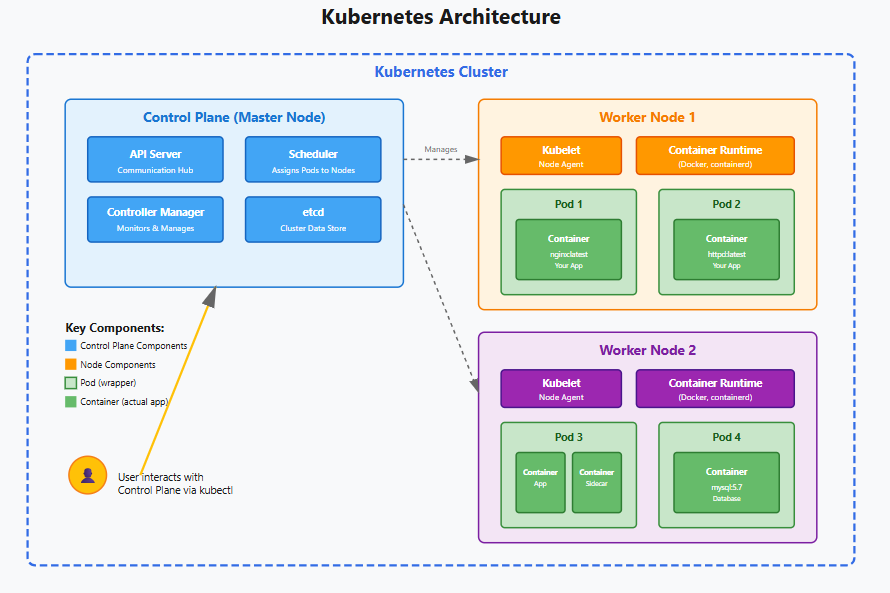

# Kubernetes Core Concepts

## 1. Cluster
- The entire Kubernetes system
- A group of machines working together

## 2. Control Plane
- The "brain" of Kubernetes
- Makes all decisions (what runs where, when to restart, etc.)
- Monitors everything in the cluster
- Runs on Master Nodes

## 3. Node
- A single machine (physical or virtual) in the cluster
- Like an individual worker in the team
- Can host multiple pods
- Types:
    - Master Node: Runs Control Plane
    - Worker Node: Runs applications

## 4. Pod
- Smallest unit in Kubernetes
- A wrapper around one or more containers
- Containers in same pod:
    - Share network (talk via localhost)
    - Share storage
- Each pod gets its own IP address

## 5. Kubelet
- Agent running on every node
- The "manager" on each node
- Jobs:
    - Talks to Control Plane
    - Makes sure containers are running
    - Reports node and pod status
    - Tells Container Runtime what to do
Also called: node agent or node process

## 6. Container Runtime
- Software that actually runs containers
- Does:
    - Pulls images from registries (Docker Hub, etc.)
    - Unpacks images
    - Runs applications inside containers

---

## 7. How They Work Together

    Cluster (the whole system)
    │
    ├── Control Plane (brain - on Master Node)
    │   └── Makes decisions about where to run apps
    │
    └── Worker Nodes (do the actual work)
        ├── Kubelet (manager on each node)
        ├── Container Runtime (Docker, etc.)
        └── Pods (contain your apps)
            └── Containers (your actual applications)

### 7.1. Simple Flow Example

1. You: "Run my app"
2. Control Plane: "I'll put it on Node 2"
3. Kubelet (on Node 2): "Got it, starting now"
4. Container Runtime: "Pulling image and starting container"
5. Pod: "Container is now running inside me"
6. Kubelet: "Everything is running, reporting back to Control Plane"

### 7.2. Kubernetes Architecture

---