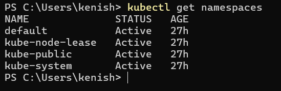
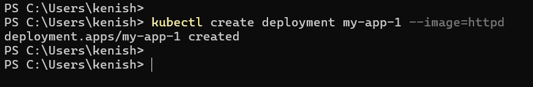
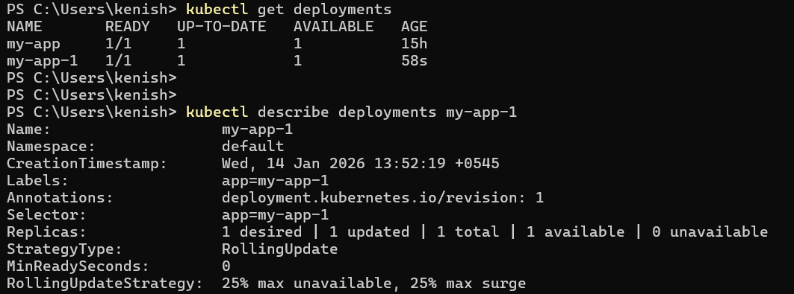
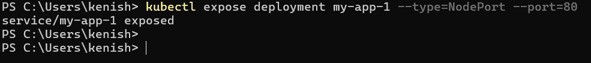
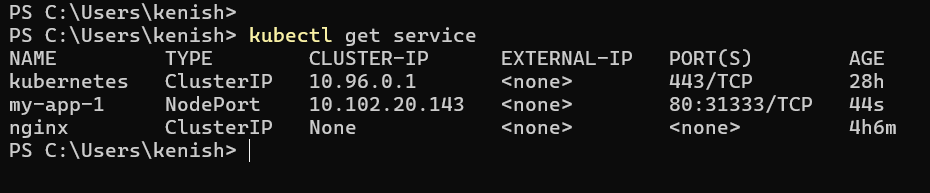
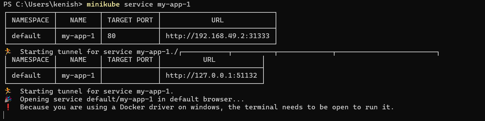
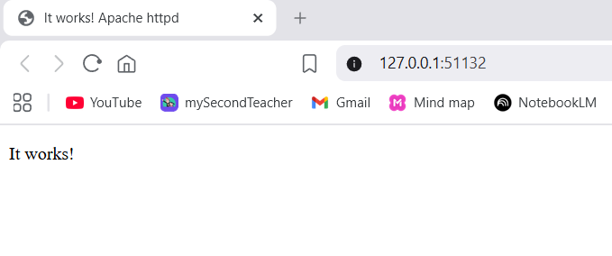

# Workshop: Container Orchestration

## Setup
- Install minikube on local
- Start cluster: `minikube start`
- Docker Desktop should be running.

## Deploy Public Image

**Step 1: Check namespaces**

```
kubectl get namespaces
```



---

**Step 2: Create deployment with public image**

```
kubectl create deployment my-app-1 --image=httpd

# Uses httpd image from Docker Hub
# Goes to 'default' namespace automatically
```


---

**Step 3: Check deployment**

```
kubectl check deployments
kubectl describe deplyment my-app-1
```


---

**Step 4: Check the pod**

```
kubectl get pods
kubectl describe pod <pod_name>
```

---

**Step 5: Expose the service**

```
kubectl expose deployment my-app-1 --type=NodePort --port=80
```



---

**Step 6: Check the service**

```
kubectl get services
kubectl describe service my-app-1
```


---

**Step 7: Access the app**

```
minikube service my-app-1
```




---