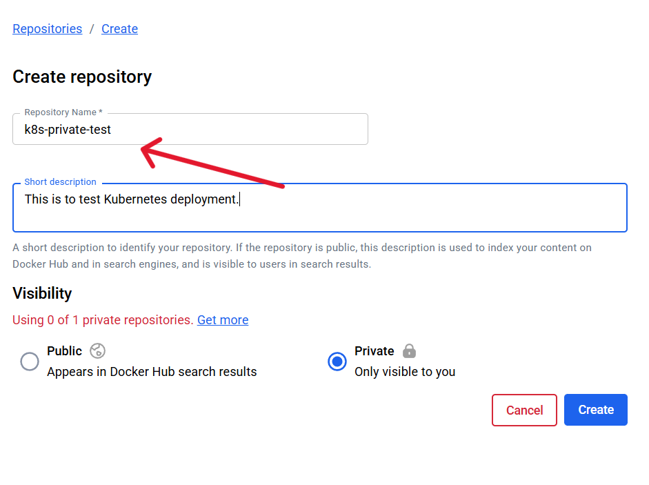
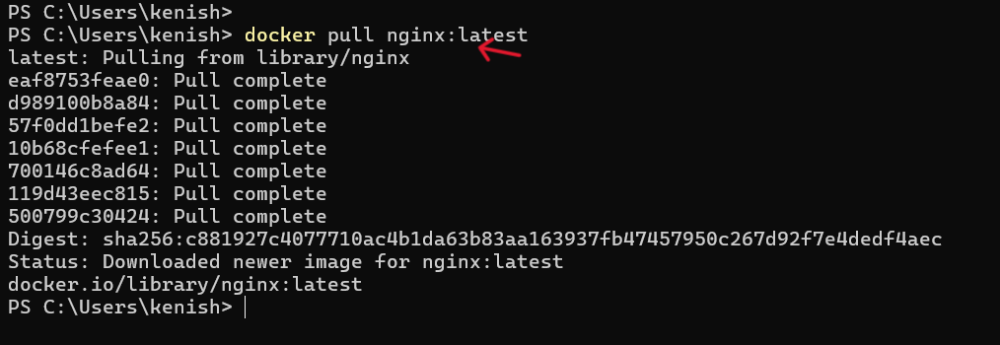
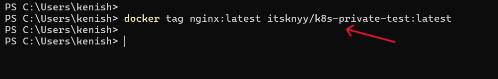
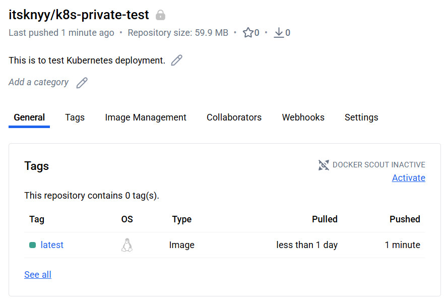
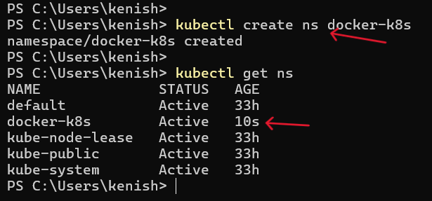
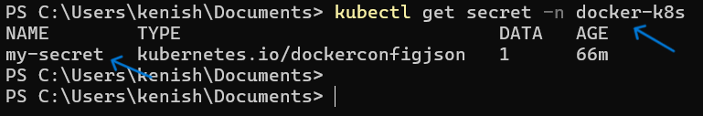
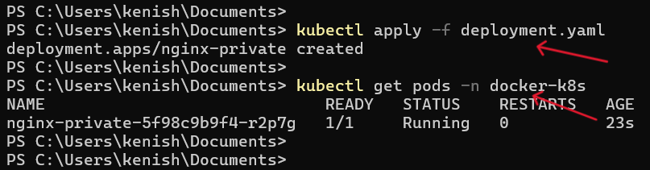
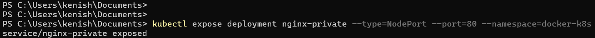
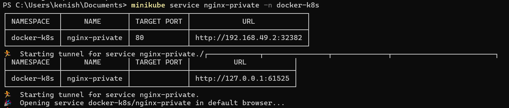
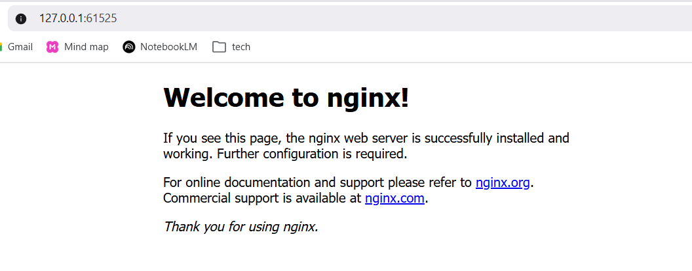

# TASK: Deploy Custom Docker Image from a Private Registry to Kubernetes

**Objective**

Deploy a custom-built Docker image stored in a private container registry as a Kubernetes Deployment and expose it using a Kubernetes Service:

**Prerequisites**

- Docker running 
- Private container registry (Docker Hub)
- Kubernetes cluster (Minikube)

---

**STEP-1: Create a private repository in DockerHub**



---

**STEP-2: Pulling NGINX Image from DockerHub**



---

**STEP-3: Tag Image for Private Registry**



---

**STEP-4: Push the image to private registry**

```
docker push itsknyy/k8s-private-test:latest
```



---

**STEP-5: Create a namespace in kubernetes**

```
kubectl create ns docker-k8s
```



---

**STEP-6: Create Kubernetes ImagePullSecret**

```
kubectl create secret docker-registry my-secret --docker-server=https://index.docker.io/v1/ --docker-username=itsknyy --docker-password=**************** --docker-email=contact.kenish@gamil.com --namespace=docker-k8s
```
- Verify:



---

**STEP-7: Kubernetes Deployment YAML**

```
apiVersion: apps/v1
kind: Deployment
metadata:
  labels:
    app: nginx-private
  name: nginx-private
  namespace: docker-k8s
spec: 
  replicas: 1
  selector:
    matchLabels:
      app: nginx-private
  template:
    metadata:
      labels:
        app: nginx-private
    spec:
      imagePullSecrets:             
      - name: my-secret                
      containers:
      - name: nginx-private
        image: itsknyy/k8s-private-test:latest
        ports:
        - containerPort: 80
```

- Apply:
```
kubectl apply -f deployment.yaml
```
- Check Status:
```
kubectl get pods -n docker-k8s
```


---

**STEP-8: Expose the Deployment via Service**



---

**STEP-9: Access the Application**



---

**STEP-10: Verify**



---


